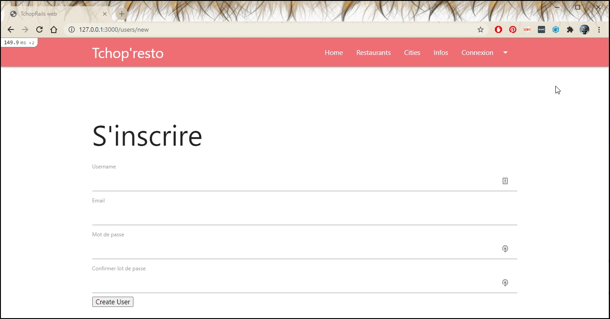
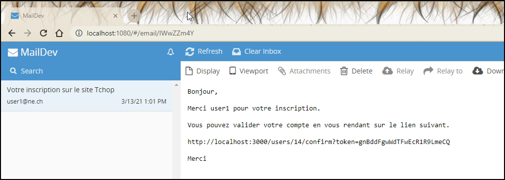

# Tchop'rails

Application Rails ayant pour but de découvrir l'environnement Rails dans un premier projet, dans le cadre de la formation MAS-RAD de la HE-ARC. 

Table des matières : 
- [Présentation de l'application](#presentation)
- [Utilisation de l'application](#utilisation)
- [Ressources externes](#ressources)
- [Tester l'application](#test)
- [Retour sur le projet](#retour)
- [Améliorations possibles](#amelioration)

## Présentation de l'application

L'application permet de gérer des restaurants et les villes dans lesquelles ils sont situés, puis filtrer en cliquant sur les noms des villes. 

Un système de gestion d'utilisateur est mis en place, avec page d'inscription, validation avec token par email, testé avec MailDev. 

Une fois connecté, il est possible d'ajouter/modifier des villes et restaurants. 

## Utilisation  
La page d'accueil de l'application propose un champ de recherche. Celui-ci permet de rechercher un restaurant contenant le mot rechercher. 

Exemple, recherche du mot "Pizzeria" : 

L'onglet "Restaurant" propose toute la liste des restaurants, ainsi qu'une liste des villes sur la partie de droite permettant de filter sur les villes existantes. 

L'onglet "Cities" liste les villes existantes dans l'application et en permet la gestion pour un utilisateur connecté. 

## Tester l'application 
### Mise en route
Après avoir cloner le repository, ouvrir un terminal et se positionner dans répertoire du projet, puis : 
* Lancer Rails avec la commande __rails server__
* Créer la base de données avec la commande  __rails db:migrate__  
* Peupler la base de donnée avec la commande __rails db:seed__  
* Se rendre sur l'adresse locale de Rails, généralement http://127.0.0.1:3000

Tester l'application comme un utilisateur non connecté, et donc sans avoir les droits d'ajout, de modification ou de suppression des objets (CRUD). 

Pour tester les services CRUD, voir le chapitre suivant. 

### Test avec un utilisateur connecté

__Utilisateur existant :__

Un utilisateur user1 est créé par la commande rails db:seed, afin de pouvoir tester les fonctionnalités CRUD de l'application. 
Username : __user1__ 
Password : __1234__ 

__Nouvel utilisateur :__ 

Se rendre sur l'onglet "Connexion > S'inscrire" pour créer un compte. 
Un email est envoyé à l'adresse email que l'utilisateur renseigne lors de son inscription. Il doit ensuite valider l'adresse email en cliquant sur un lien qui contient un token. 

Une ressource recevant les emails sur le port 1025 doit être installée en local. 
Nous avons utilisé Maildev lors de notre développement. 

__Une fois connecté__
Les boutons "Edit" et "Destroy" apparaissent dans les listes. 
Les urls ne redirigent plus sur la page d'inscription avec un message d'erreur si on tente d'accéder directements aux urls des services CRUD. 

## Ressources externes 

* Maildev (Test des emails) : https://github.com/maildev/maildev
* Materialize (CSS et composants JS) : https://materializecss.com/
* Melvinchng (Tutoriel Installation locale de Rails Windows et Mac) : https://melvinchng.github.io/rails/WindowsInstallationV2.2.3.html#chapter-1-windows-installation-guide-for-ruby-22x
* Grafikart (Tutoriel gestion des utilisateurs) : https://grafikart.fr/tutoriels/tp-users-854
* SQLiteStudio : https://sqlitestudio.pl/
SQLiteStudio permet de visualiser la base de données SQLite de l'application, comme le propose par exemple pgAdmin ou DB Browser. 

## Retour sur le projet
Materialize et Maildev 
Github 

Le projet nous a permis d’acquérir les bases nécessaires du framework ainsi que certaines de ses subtilités. En effet, l’intuitivité du codage qui se trouve dans la syntaxe peu verbeuse ainsi que dans les conventions de Rails ont permis de développer des fonctionnalités rapides. De ce fait, c’est une technologie qui demande une prise en main dans premier temps mais qui devient de plus en plus intéressante à l’utilisation et facile.

## Améliorations possibles
* Gestion de l'avatar dans le profil du user. 
* Tests unitaires 

Une multitides de fonctionnalités pourraient ensuite améliorer l'application. En voici quelques unes : 
* Ajouter les services proposés par les établissements et pouvoir rechercher par rapports à ces services (livraison, plats à emporter, brunch, etc.)
* Une gestion des horaires d'ouverture permettrait d'afficher les établissements ouverts au moment où l'on accède à l'application. 
* Intégration d'une map pour la localisation du restaurant.
* Indication d'appréciation (étoiles) + les commentaires.

